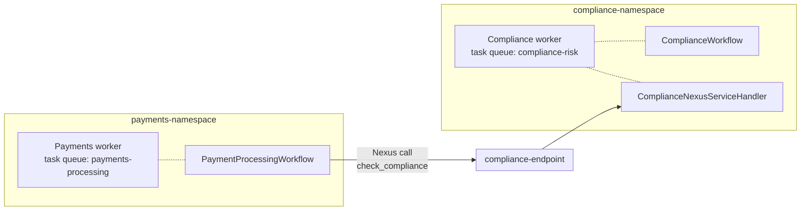

# CLAUDE.md

This file provides guidance to Claude Code (claude.ai/code) when working with code in this repository.

## What this repo is

Code companion for the **Introduction to Temporal Nexus** workshop (Replay 2026). The companion repo
[`workshop-nexus-intro`](https://github.com/temporalio/workshop-nexus-intro) holds the slides, Instruqt
lab, and course plan; this repo holds only the per-chapter source the attendees run on their laptops.

There is no test suite, no CI, and no library code to ship. The "product" is the per-chapter Python
snapshots under `exercises/` and the Java polyglot demo under `polyglot/java-legacy/`. Edits should
preserve the pedagogical progression chapter-to-chapter.

## Common commands

One-time setup from the repo root:

```bash
uv sync                       # creates the single root .venv all chapters share
temporal server start-dev     # dev server at localhost:7233, UI at localhost:8233
```

Per-chapter runtime (from inside `exercises/<chapter>/exercise/` or `exercises/<chapter>/solution/`):

```bash
# Ch 1 only — monolith, single worker, default namespace
uv run python -m payments.worker
uv run python -m payments.starter

# Ch 3–7 — split workers, two namespaces
uv run python -m compliance.worker     # terminal 1
uv run python -m payments.worker       # terminal 2
uv run python -m payments.starter      # terminal 3

# Ch 6 only — submit a human review for the MEDIUM-risk TXN-B
uv run python -m payments.review_starter

# Ch 7 only — exercise non-retryable, retryable, cancellation, and circuit-breaker paths
uv run python -m payments.lifecycle_starter
```

`uv run` walks up to the root `pyproject.toml` and uses the root `.venv`; the chapter's local
`payments/`, `compliance/`, and `shared/` packages get picked up because the working directory is on
`sys.path`. **Always run from inside a chapter directory** — running from the repo root fails with
import errors.

Ch 2 is setup-only. The namespaces and Nexus endpoint are created interactively with `temporal operator`
in that chapter and persist for every later chapter:

```bash
temporal operator namespace create --namespace payments-namespace
temporal operator namespace create --namespace compliance-namespace
temporal operator nexus endpoint create \
  --name compliance-endpoint \
  --target-namespace compliance-namespace \
  --target-task-queue compliance-risk \
  --description-file compliance-endpoint.md
```

Java polyglot (from `polyglot/java-legacy/`):

```bash
mvn compile
mvn -q exec:java
```

## Architecture

### The Nexus contract

`shared/service.py` declares a single `@nexusrpc.service` class — `ComplianceNexusService` — with two
operations: `check_compliance` and `submit_review`. This file is the *only* code-level contact point
between the Payments and Compliance teams from Ch 2 onward. Payments imports it to build a Nexus
client (`workflow.create_nexus_client(service=..., endpoint="compliance-endpoint")`); Compliance
imports it to register a `@nexusrpc.handler.service_handler(service=...)` on its worker.

The matching server-side artifact is a Nexus Endpoint named `compliance-endpoint`, registered against
`compliance-namespace` / `compliance-risk` task queue. Endpoints live at the cluster level, not inside
a namespace — that is what lets them bridge teams.

### Two-team / two-namespace topology (Ch 3 onward)



- `payments-namespace` runs the Payments worker on the `payments-processing` task queue.
- `compliance-namespace` runs the Compliance worker on the `compliance-risk` task queue.
- The Payments workflow calls into Compliance only via `compliance-endpoint`. There is no shared task
  queue, no shared workflow registry, no Python import from one team's worker into the other's.

### Chapter progression

Each chapter is a complete, self-contained snapshot — never delta-style edits over a prior chapter at
runtime. The deltas exist only in attendee-facing TODOs.

| Ch | Theme                    | Compliance handler shape                              |
| -- | ------------------------ | ----------------------------------------------------- |
| 1  | Monolith                 | `check_compliance` is a Payments-side activity        |
| 2  | Service contract         | (no workers; contract + endpoint only)                |
| 3  | Sync handler             | `@nexusrpc.handler.sync_operation`                    |
| 4  | Caller swap              | same as Ch 3 (caller workflow now uses Nexus)         |
| 5  | Async / workflow-backed  | `@nexus.workflow_run_operation` → `ComplianceWorkflow`|
| 6  | Updates                  | adds `@workflow.update review` + real `submit_review` |
| 7  | Lifecycle / errors       | adds failure-injection branches + `lifecycle_starter` |

### `exercise/` vs `solution/`

- Ch 1 ships only `solution/` (no TODOs).
- Ch 2–4 `exercise/` is the **previous chapter's `solution/` plus new TODO callouts**.
- Ch 5–7 `exercise/` may also include skeleton files — e.g. an empty `compliance/workflows.py`
  that raises `NotImplementedError` — that the chapter's TODOs ask the attendee to fill in.
- TODO numbering is monotonically increasing across the whole workshop (Ch 7's TODO is `TODO 13`).
  When editing TODOs, keep them aligned with `assignment.md` in the companion content repo and the
  authoring standard. Numbering must not collide across chapters.

When changing one chapter's `solution/`, propagate the change forward into every later chapter's
`exercise/` and `solution/` that ships the same file. The chapters drift if you don't.

### Workflow IDs are chapter-prefixed

Workflow IDs in starters and handlers include the chapter number — e.g. `payment-ch05-TXN-A`,
`compliance-ch05-TXN-A`. This was added deliberately so attendees can re-run earlier chapters
without `WorkflowAlreadyStartedError` / cross-chapter Event History contamination. **When adding a
new starter or workflow ID, keep the `ch{NN}` prefix.** The exception is `review_starter.py`, which
appends a fresh `uuid.uuid4()` to its caller-side `ReviewCallerWorkflow` ID so reviewers can re-submit
freely; the long-running `compliance-chNN-{transaction_id}` it targets keeps the stable business ID.

### Polyglot Java worker

`polyglot/java-legacy/` is a **drop-in replacement for the Python compliance worker, behavior-equivalent
to Ch 6**. It targets `compliance-namespace` / `compliance-risk` and serves the same
`ComplianceNexusService` contract over the wire.

- Run it against the Ch 5, 6, or **7 (preferred)** Python payments side. The Ch 7 caller has the
  timeouts and `ReviewCallerWorkflow` registered, but the Java handler does **not** implement Ch 7's
  failure-injection branches (`TXN-FAIL-*`, `TXN-CIRCUIT-*`), so use `payments.starter`, not
  `payments.lifecycle_starter`.
- The Python and Java compliance workers cannot run simultaneously — they poll the same task queue
  and workflow histories from different SDKs are not interchangeable. Stop the Python worker first.
- The Java side carries the polyglot tax: `@Operation(name = "check_compliance")` and `@JsonProperty`
  annotations on every field/getter/constructor argument force snake_case wire-compat with the Python
  contract. Don't "clean up" these annotations; without them deserialization breaks across the wire.

## Authoring conventions

- **Python target**: 3.14+. `temporalio>=1.24.0`, `nexus-rpc>=1.1.0,<2`. No other deps.
- **Imports inside `@workflow.defn` files**: wrap non-stdlib / non-Temporal imports in
  `with workflow.unsafe.imports_passed_through():` (see any chapter's `payments/workflows.py`). The
  Nexus client construction (`workflow.create_nexus_client(...)`) lives in the workflow body, not at
  module scope.
- **`USE_EXISTING` on workflow-backed Nexus operations**: `check_compliance` starts the backing
  workflow with `id_conflict_policy=WorkflowIDConflictPolicy.USE_EXISTING` so a Nexus retry returns a
  handle to the running workflow instead of failing with `WorkflowAlreadyStartedError`. Preserve this.
- **Three timeouts on the Nexus call** in `payments/workflows.py` from Ch 5 on:
  `schedule_to_close_timeout`, `schedule_to_start_timeout`, `start_to_close_timeout`. The chapter
  prose explains each — keep all three when editing.
- **Markdown diagrams**: never ASCII art. Always Mermaid in fenced ```` ```mermaid ```` blocks
  (per the user's global markdown rule).

## Notes for editing

- `commit-msg.md` is gitignored — never stage it.
- `tmp/` at the repo root is scratch / gitignored.
- `.venv/` is the single shared environment created by `uv sync` at the root; never create per-chapter
  venvs.
- Keep `compliance-endpoint.md` (the Markdown description attached to the Nexus Endpoint) in sync with
  whatever the contract advertises. It is the only Nexus artifact attendees see in the Web UI.
